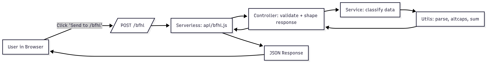

## BFHX – REST API and Minimal UI

A lightweight Node.js serverless REST API hosted on Vercel with a simple web UI to test requests. The API accepts an array of values and returns:
- is_success status
- user_id, email, roll_number
- odd_numbers, even_numbers (as strings)
- alphabets (uppercased)
- special_characters
- sum of numbers (as string)
- concat_string: all alphabetical characters concatenated in reverse order with alternating capitalization

### Tech Stack
- Runtime: Node.js (Serverless)
- Hosting: Vercel
- UI: Plain HTML/CSS/JS under `public/`

### Project Architecture
- `api/bfhl.js`: Serverless function entrypoint (Vercel). Handles CORS, parsing, errors, and invokes controller.
- `src/controllers/bfhl-controller.js`: Validates input and shapes the final response.
- `src/services/bfhl-service.js`: Core classification logic (numbers/alphabets/specials, sum, concat string).
- `src/utils/parse.js`: Helpers for digit/letter checks and BigInt-safe sum.
- `src/utils/altcaps.js`: Alternating-caps reverse logic for concatenated letters.
- `src/config.js`: Identity (user_id/email/roll) via environment variables.
- `public/`: Minimal UI for testing: `index.html`, `styles.css`, `app.js`.
- `vercel.json`: Rewrites `/bfhl` to the serverless function at `/api/bfhl`.

```
Root
├─ api/
│  └─ bfhl.js
├─ src/
│  ├─ controllers/
│  │  └─ bfhl-controller.js
│  ├─ services/
│  │  └─ bfhl-service.js
│  ├─ utils/
│  │  ├─ parse.js
│  │  └─ altcaps.js
│  └─ config.js
├─ public/
│  ├─ index.html
│  ├─ styles.css
│  └─ app.js
└─ vercel.json
```

### User Flow (High-Level)




---

## API

- Base route: `/bfhl` (rewritten to `/api/bfhl` by Vercel)
- Method: `POST`
- Status code: `200` on success; `200` with `is_success=false` for validation errors; `405` for non-POST.
- Headers: `Content-Type: application/json`

### Request Body
```json
{
  "data": ["a", "1", "334", "4", "R", "$"]
}
```

### Response Body (success)
```json
{
  "is_success": true,
  "user_id": "gourab_choudhury_17091999",
  "email": "c.gourab180@gmail.com",
  "roll_number": "22BCE8609",
  "odd_numbers": ["1"],
  "even_numbers": ["334","4"],
  "alphabets": ["A","R"],
  "special_characters": ["$"],
  "sum": "339",
  "concat_string": "Ra"
}
```

### Response Body (invalid body)
```json
{
  "is_success": false,
  "user_id": "gourab_choudhury_17091999",
  "email": "c.gourab180@gmail.com",
  "roll_number": "22BCE8609",
  "odd_numbers": [],
  "even_numbers": [],
  "alphabets": [],
  "special_characters": [],
  "sum": "0",
  "concat_string": "",
  "message": "Body must be JSON with a 'data' array"
}
```

### Notes
- Numbers must be returned as strings. Sum is a string and BigInt-safe.
- Alphabetical tokens are uppercased in `alphabets`. `concat_string` is from all letters of all alpha tokens in reverse with alternating caps.
- `user_id` is `{full_name_ddmmyyyy}` where `full_name` is lowercase with underscores.

---

## Sample Requests & Responses

### Example A
Request:
```json
{ "data": ["a","1","334","4","R","$"] }
```
Response:
```json
{
  "is_success": true,
  "user_id": "gourab_choudhury_17091999",
  "email": "c.gourab180@gmail.com",
  "roll_number": "22BCE8609",
  "odd_numbers": ["1"],
  "even_numbers": ["334","4"],
  "alphabets": ["A","R"],
  "special_characters": ["$"],
  "sum": "339",
  "concat_string": "Ra"
}
```

### Example B
Request:
```json
{ "data": ["2","a","y","4","&","-","*","5","92","b"] }
```
Response:
```json
{
  "is_success": true,
  "user_id": "gourab_choudhury_17091999",
  "email": "c.gourab180@gmail.com",
  "roll_number": "22BCE8609",
  "odd_numbers": ["5"],
  "even_numbers": ["2","4","92"],
  "alphabets": ["A","Y","B"],
  "special_characters": ["&","-","*"],
  "sum": "103",
  "concat_string": "ByA"
}
```

### Example C
Request:
```json
{ "data": ["A","ABcD","DOE"] }
```
Response:
```json
{
  "is_success": true,
  "user_id": "gourab_choudhury_17091999",
  "email": "c.gourab180@gmail.com",
  "roll_number": "22BCE8609",
  "odd_numbers": [],
  "even_numbers": [],
  "alphabets": ["A","ABCD","DOE"],
  "special_characters": [],
  "sum": "0",
  "concat_string": "EoDdCbAa"
}
```

---

## Setup & Run Locally

Prerequisites: Node.js 18+, npm.

1) Install the Vercel CLI (optional for local dev):
```bash
npm i -g vercel
```

2) Run with Vercel Dev to emulate serverless locally:
```bash
vercel dev
```
This serves the static UI and the serverless function. Open the printed URL and use the tester UI.

3) Alternatively, deploy directly to Vercel from the dashboard without local dev.

### Environment Variables
Set these in Vercel Project Settings → Environment Variables (or as local env when running builds):
- `FULL_NAME` (e.g. `Gourab Choudhury`)
- `DOB_DDMMYYYY` (e.g. `17091999`)
- `EMAIL` (e.g. `c.gourab180@gmail.com`)
- `ROLL_NUMBER` (e.g. `22BCE8609`)

Defaults are already set in `src/config.js` for quick testing.


## UI Quick Start
Open the deployed site root. Use:
- “Fill Sample A/B/C” buttons to populate inputs.
- Click “Send to /bfhl” to see the response.

---

## License
MIT
